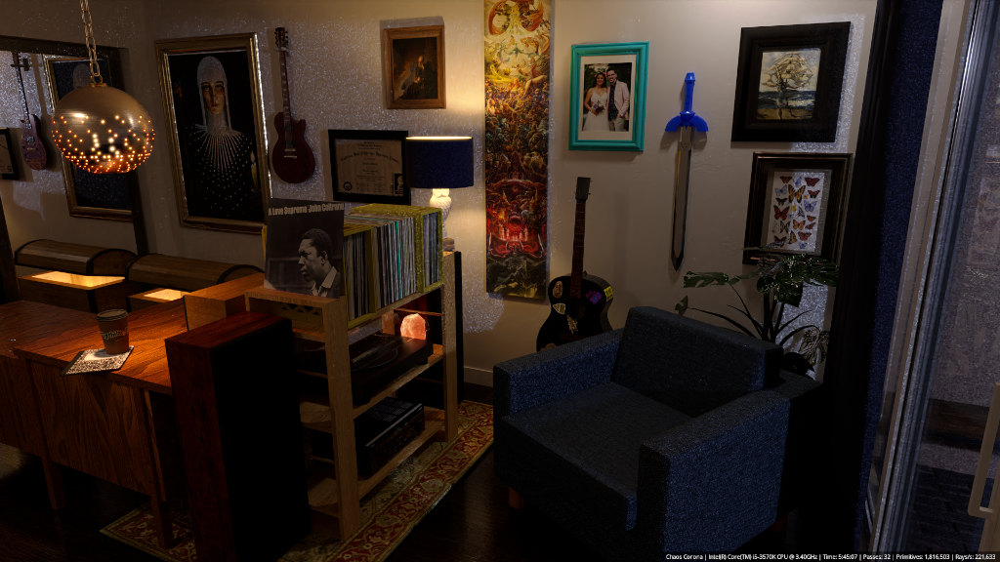
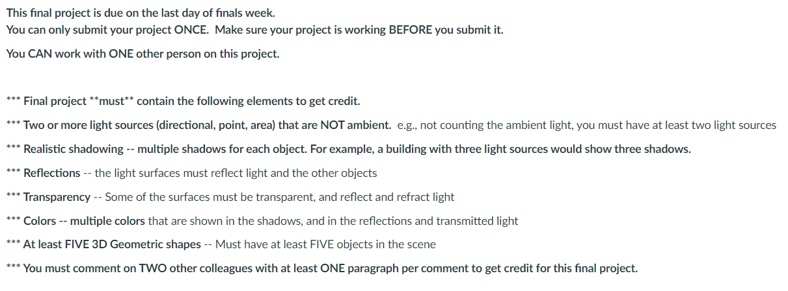

# CPSC 484 Principles of Computer Graphics : Final Project

## Turn-in Version 

_This version is scaled down(1024x576) from the original(1920x1080)_

---

### The project

---

_This is a non-coding project. This repos is for the purpose of hosting a few images related to the project as well allow for use of project boards._